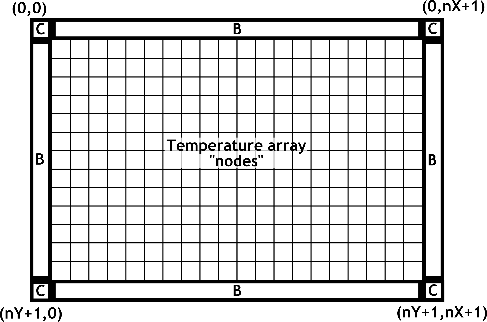

# Thermal_Mesh
 Implements 2D versus time finite element thermal diffusion. Uses explicit algorithm for the time dimension.

 # Modeling Thermal Diffusivity II
## Versions
- 19a
  - Totally redefine approach. The main class is ThermalMesh with the temperature
    stored in a 2D `numpy` array.
  - `savePGM` to write an image file
  - `setBorderAdiabatic` to set no heat flow out of the side
  - Implemented _Newton's Law of Cooling_
  - `iterate` using equation below

- 19b
  - Add heat input to certain nodes
  - Add constant Temperature nodes

- 19c
  - Clean up code and documentation
  - Change image & animation code

- 20a
  - Add explicity _template_ to class. A template describes what a node is
    or does. A template must be set before calculation can be done Examples are:
    - .: a normal temperature evolving node
    - Q: constant heat input to node
    - T: constant termperature node
    - P: a periodic boundary node
    - A: an adiabatic border node

# Thermal Modeling

## Definitions
_Heat_ is the _transfer_ of thermal energy. Note that it is not the temperature of
an object, or a property of an object, but a _change_ or movement of thermal energy.
The main mechanisms of heat transfer are _conduction_ , _convection_ , and _radiation_ .

## Heat Transfer Physics
Heat is thermal energy associated with the temperature-dependent
motion of particles.
The macroscopic energy equation for infinitesimal volume used in
heat transfer analysis is
$$
\nabla \cdot \mathbf{q} = -c_p \rho \frac{\partial T}{\partial t} +
\sum_i{\dot s_i}
$$
where $\mathbf{q}$ is the _heat flux vector_ , $T$ is the temperature, $-c \rho_p \frac{\partial T}{\partial t}$
is the temporal change of internal energy ($\rho$ is density, $c_p$ is  
specific heat capacity at constant pressure, $T$ is temperature and $t$ is time.)

## Fourier's Model of Heat Conduction
Fourier's law of thermal conduction is
$$
\mathbf{q} = -k \nabla T
$$
where $k$ is the material's conductivity in $W/({m \cdot K})$.

## The Heat Equation
Working from the equation in _Heat Transfer Physics_ , you can derive the _Heat Equation_
$$
\frac{\partial T}{\partial t} = \frac{k c_p}{\rho} \nabla^2 T = \alpha \nabla^2 T
$$
where
$$\alpha = \frac{k}{c_p \rho}$$
is the _thermal diffusivity_ of the medium. The table below shows some values
for steel and aluminum.

| Material | Thermal Conductivity | Heat Capacity | Density | $\alpha$ |
| --- | ---| --- | --- | --- |
| - | ($W / (m \cdot K$)) | ($J/(kg \cdot K$) | ($kg/m^3$) | ($m^2/s$) |
| Aluminum | 240 | 900 | 2700 |  80 |
| Steel    |  35 | 480 | 7900 | 2.1 |

### General Heat Loss
If there are sources or sinks of thermal energy, the heat equation becomes
$$
\rho c_p \frac{\partial T}{\partial t} - k \nabla^2 T = \dot{q_V}
$$
where $\dot{q_V}$ is the volumetric heat source (a negative $\dot{q_V}$ is a _heat sink_.)

You can model the general heat loss by assuming _Newton's Law of Cooling_
$$
\frac{d T}{d t} = \beta (T - T_0)
$$
where $\beta$ is a constant and $T_0$ is the ambient termperature. The heat equation
then becomes
$$
\frac{\partial T}{\partial t} - \alpha \nabla^2 T = \dot{q_V} -\beta (T - T_0)
$$
Note that if $T > T_0$ there is cooling, and if $T < T_0$ there is warming.

## Applying the Heat Equation
We want to apply the heat equation to simulate the time evolution of
the temperature of a plate, so we can write the equation as
$$
\frac{\partial T}{\partial t} = \alpha \nabla^2 T -\beta (T - T_0) + \dot q(x,y)
$$
where $\dot q(x,y) $ is where heat is flowing into ($\dot q > 0$) or out of
($\dot q < 0$) the plate. The $\dot q$ term is used to model a heat gun pointed at
a certain area of the plate, or maybe and ice pack against the plate.

Another possibility is that you can have the plate in contact with a constant
_temperature_ source, so the software ought to be able to handle that situation also.

Now make the times discrete, so
$$
\begin{align}
T^{i+1} &= T^i + \frac{\partial T}{\partial t} \vert_{t^i} \Delta t +
           \dot q(x,y) \Delta t \\
        & = T^i + \left ( \alpha \nabla^2 T^i -\beta (T^i - T_0) \right ) \Delta t
           + \dot q(x, y) \Delta t
\end{align}
$$

Next we need to make the spatial coordinates, $x$ and $y$, discrete.
We will simplify the grid by requiring it to be square so $\Delta x = \Delta y$.
I will use the
indices $j$ and $k$ for $x$ and $y$ respectively.
The $\nabla^2$ operator is basically the sum of the second
derivatives in Cartesian coordinates
$$
\nabla^2 = \frac{\partial^2 T}{\partial x^2} + \frac{\partial^2 T}{\partial y^2}
$$
When discretized, the second derivative becomes, in the $x$ direction
$$
\frac{\partial^2 T}{\partial x^2}|_{t_i} \approx
  \frac{T_{j+1,k}^i - 2 T_{j,k}^i + T_{j-1,k}^i}{{\Delta x}^2}
$$

So the final result is
$$
T_{j,k}^{i+1} = T_{j,k}^i + \frac{\alpha \Delta t}{{\Delta x}^2}
\left({T_{j+1,k}^i + T_{j-1,k}^i + T_{j,k+1}^i + T_{j,k-1}^i - 4 T_{j,k}^i}\right)
- \beta \Delta t\left({T_{j,k}^i - T_0}\right)
+ \Delta t \; \dot q_{j,k}
$$

An important point to note is that _ALL_ of the right side terms are at time $t_i$
and the only left side term is at $t_{i+1}, so the spatial data at one time is
used to calculate the spatial data at the next time. This is a huge simplifying
factor in this model of thermal diffusion.

All we have to do now is program this!

## Python Implementation Hints
From _Python Heat Transfer_ I found [here](http://www.cs.jhu.edu/~joanne/cs112/assign/p6.pdf).

Use a 2D `numpy` array for the spatial temperature on a plate. Hints:
1. _To implement __adiabatic__ edges_ (no heat flows
off of the plate at the borders) add one row or column to the edge and give the values
the _same_ values as the last row or column. If there is no temperature difference at the
the edge, heat won't flow that direction.

2. _To increase efficiency_ you can use the `np.roll` to rotate the array in a direction.
then you can do the sum $T_{i,j+1,k} + T_{i,j-1,k} + T_{i,j,k+1} + T_{i,j,k-1}$ by rolling
and adding.
Since we are going to have extra rows and columns on the edges, we do not have
to worry about the temerature at the bottom affecting the temperature at the top,
And similarly for the other three sides.
The missing elements in the corners don't matter, so define a rectangular array.

BTW, if you want periodic boundary conditions, leave out the borders and the solution
will smoothly roll across the boundaries.

In the figure, "B" are border rows and columns used to implement (or not) an
adiabatic edge to the plate.
The contents of the boxes labeled "C" are arbitrary; they are not used in
the calculation. The python coordinates of the corner pixels are shown.

3. To add _Heat Sources and Sinks_, create both a template and
a `heatSource` array the size of your
 array that adds (or subtracts) heat from particular cells.
 The non-zero values are the amount of heat added or subtracted from a
 given node.
 We are assuming
 the heat sources or sinks are constant with time. At each time step, the
 temperature
 of those cells is changed by the value $\dot q_{j,k} \Delta t$.

4. To implement constant temperature nodes, modify the template and create
 an array the size of the nodes array where the non-zero values are the
 fixed temperatures.
